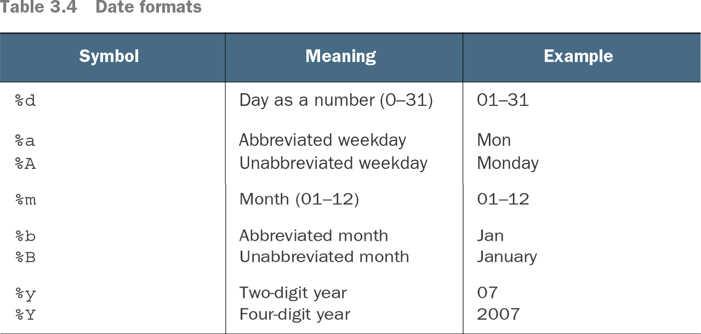

```{r setup, include=FALSE}
knitr::opts_chunk$set(echo = TRUE)
```

# R Markdown

This is an R Markdown document. Markdown is a simple formatting syntax for authoring HTML, PDF, and MS Word documents. For more details on using R Markdown see <http://rmarkdown.rstudio.com>. A cheat sheet can be found at https://www.rstudio.com/wp-content/uploads/2015/02/rmarkdown-cheatsheet.pdf.

**Reference:** Code in this document comes from [R in Action, Third Edition](https://www.manning.com/books/r-in-action-third-edition?)

******
## An Example {.tabset}
```{r}
leadership <- data.frame(
   manager = c(1, 2, 3, 4, 5),
   date    = c("10/24/08", "10/28/08", "10/1/08", "10/12/08", "5/1/09"),
   country = c("US", "US", "UK", "UK", "UK"),
   gender  = c("M", "F", "F", "M", "F"),
   age     = c(32, 45, 25, 39, 99),
   q1      = c(5, 3, 3, 3, 2),
   q2      = c(4, 5, 5, 3, 2),
   q3      = c(5, 2, 5, 4, 1),
   q4      = c(5, 5, 5, NA, 2),
   q5      = c(5, 5, 2, NA, 1)
)
```
### Questions

* The five ratings (q1 to q5) need to be combined, yielding a single mean deferential score from each manager.
* In surveys, respondents often skip questions. For example, the boss rating manager 4 skipped questions 4 and 5. You need a method of handling incomplete data. You also need to recode values like 99 for age to missing.
* There may be hundreds of variables in a dataset, but you may only be interested in a few. To simplify matters, you’ll want to create a new dataset with only the variables of interest. 
* Past research suggests that leadership behavior may change as a function of the manager’s age. To examine this, you may want to recode the current values of age into a new categorical age grouping (for example, young, middle-aged, elder).
* Leadership behavior may change over time. You might want to focus on deferential behavior during the recent global financial crisis. To do so, you may want to limit the study to data gathered during a specific period of time (say, January 1, 2009 to December 31, 2009)

### Creating New Variables

New variables can simply be created as *variable <- expression*
The following code provides three ways of creating new variables, such that the new variables are also incorporated into the original data frame.

```{r}
mydata<-data.frame(x1 = c(2, 2, 6, 4),  x2 = c(3, 4, 2, 8))
mydata$sumx <- mydata$x1 + mydata$x2
mydata$meanx <- (mydata$x1 + mydata$x2)/2

attach(mydata)
mydata$sumx <- x1 + x2
mydata$meanx <- (x1 + x2)/2
detach(mydata)

mydata <- transform(mydata,
 sumx = x1 + x2,
 meanx = (x1 + x2)/2)
```

### Recoding Variables
Recoding involves creating new values for variables based on some conditions. For example, you might want to 

* Change a continuous variable into a category
* Replace missing values
* Create a variable based on cutoff values

To recode, we use R's logical operators.

Assume you want to recode the ages of the managers in the leadership dataset from continuous values to a categorical variable *agecat (Young, Middle Aged, Elder)*. You need to also recode the value 99 as missing.
```{r}
leadership$age[leadership$age == 99] <- NA # This recodes the variable age, when age is 99 to NA
# The statement *variable[condition]<-expression will only make the assignment when TRUE

# Now we can create the categorical variable
leadership$agecat[leadership$age > 75] <- "Elder"
leadership$agecat[leadership$age >= 55 &  leadership$age <= 75] <- "Middle Aged"
leadership$agecat[leadership$age < 55] <- "Young"

# Alternatively
leadership <- within(leadership,{
 agecat <- NA
 agecat[age > 75] <- "Elder"
 agecat[age >= 55 & age <= 75] <- "Middle Aged"
 agecat[age < 55] <- "Young" })

# agecat is now a character variable. We should really turn it into an ordered factor.
leadership$agecat <- factor(leadership$agecat,ordered = TRUE,levels=c("Elder","Middle Aged","Young"))

```

### Renaming Variables


```{r}
#fix(leadership) # To interactively rename variables, or 
names(leadership)[2] <- "testDate" # renames the second variable to *testDate*

```
```{r}
names(leadership)[2] <- "date"
names(leadership)[6:10] <- c("item1", "item2", "item3", "item4", "item5")
```

### Missing Values
The function is.na() allows you to test for the presence of missing values
```{r}
is.na(leadership$q4)
is.na(leadership[,6:10])

leadership$age[leadership$age == 99] <- NA # This codes values of 99 to NA, so they are not included in calculations

# We might also want to exclude missing values from analyses. For example
x <- c(1, 2, NA, 3)
y <- x[1] + x[2] + x[3] + x[4]
z <- sum(x)

y <- sum(x, na.rm=TRUE)

z <- sum(leadership$q4, na.rm = T)

# We can also remove any observation with missing data using the na.omit() function.

leadership
newdata <- na.omit(leadership)
newdata
```

### Date Values


```{r}
# The default format for inputting dates is yyyy-mm-dd.
mydates <- as.Date(c("2007-06-22", "2004-02-13"))

# To convert strings to dates
strDates <- c("01/05/1965", "08/16/1975")
dates <- as.Date(strDates, "%m/%d/%Y") #Reads as mm/dd/yyyy

# You can also specify your own format
myformat <- "%m/%d/%y"
leadership$date <- as.Date(leadership$date, myformat)

# Sys.time and Sys.Date returns the system's idea of the current date with and without time.
Sys.Date()
today <- Sys.Date()
format(today, format="%B %d %Y")
format(today, format="%A")


# date Returns a character string of the current system date and time.
date()

# We can also do operations with Date
startdate <- as.Date("2020-02-13")
enddate   <- as.Date("2021-01-22")
days      <- enddate - startdate
days

today <- Sys.Date()
dob   <- as.Date("1956-10-12")
difftime(today, dob, units="weeks")
```

### Type Conversions


Test | Convert
---- |--------
is.numeric() | as.numeric()
is.character()| as.character()
is.vector() |as.vector()
is.matrix() |as.matrix()
is.data.frame() |as.data.frame()
is.factor() |as.factor()
is.logical() |as.logical()

```{r}
a <- c(1,2,3)
a
is.numeric(a)
is.vector(a)
a <- as.character(a)
a
is.numeric(a)
is.vector(a)
is.character(a)
```

## Exploring Datasets

```{r}
# A complete list of built-in datasets in R
library(help='datasets')

# let's explore the iris dataset
head(iris) # what types of variables are there?

summary(iris)

dim(iris)

# What type of graph should we plot for Sepal.length?

hist(iris$Sepal.Length,
     col='steelblue',
     main='Histogram',
     xlab='Length',
     ylab='Frequency')

```

### Summary Statistics

```{r}
# Create a basic summary table

library(psych)

describe(iris)
describe(iris, fast = T)
describe(iris[,c("Sepal.Length","Sepal.Width")],fast=T)

describeBy(iris, group=iris$Species,fast=T)

```
## Graphics

```{r}
library(esquisse)
#esquisser(iris)
```


### Sorting and Merging

```{r}
newdata <- leadership[order(leadership$age),] # sorts by age
newdatad <- leadership[order(-leadership$age),] # sorts by descending order of age

attach(leadership)
newdata <-leadership[order(gender, -age),] # sort by gender, and descending age
detach(leadership)

```
To merge two data frames (datasets) horizontally, you use the merge() function. In
most cases, two data frames are joined by one or more common key variables (that is,
an inner join). For example,

> total <- merge(dataframeA, dataframeB, by="ID")

merges dataframeA and dataframeB by ID. Similarly,

> total <- merge(dataframeA, dataframeB, by=c("ID","Country"))

If you’re joining two matrices or data frames horizontally and don’t need to specify a
common key, you can use the cbind() function:

> total <- cbind(A, B)

To join two data frames (datasets) vertically, use the rbind() function: 

> total <- rbind(dataframeA, dataframeB)

### Subsetting Datasets

Previously we saw that we can access elements of a dataframs as *dataframe[row indices, column indices]*. For example 

```{r}
# newdata <- leadership[c(-8,-9)]
# 
# # alternatively
# 
# myV <- c("q3", "q4")
# newdata <- leadership[myV] # accomplishes the same
# newdata
# 
# # Dropping variables
# # Assuming that we want to drop q3 and q4
# newdata <- leadership[c(-8,-9)] # or alternatively
# 
# myvars <- names(leadership) %in% c("q3", "q4") 
# newdata <- leadership[!myvars]
# 
# # Selecting Observations
# newdata <- leadership[1:3,] 
# 
# newdata <- leadership[leadership$gender=="M" & 
#  leadership$age > 30,]  # Select all men over 30
# 
# attach(leadership) 
# newdata <- leadership[gender=='M' & age > 30,] 
# detach(leadership)


```

```{r}
# Now the easier way. subset() function
# newdata <- subset(leadership, age >= 35 | age < 24,
#  select=c("q1", q2, q3, q4)) 
# 
# newdata <- subset(leadership, gender=="M" & age > 25, 
#  select=gender:q4) 
# 
# # Finally, random samples
# mysample <- leadership[sample(1:nrow(leadership), 3, replace=FALSE),]

```


